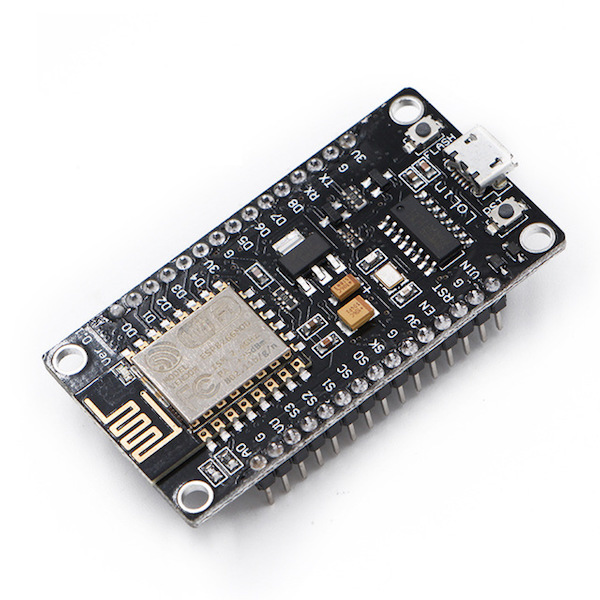
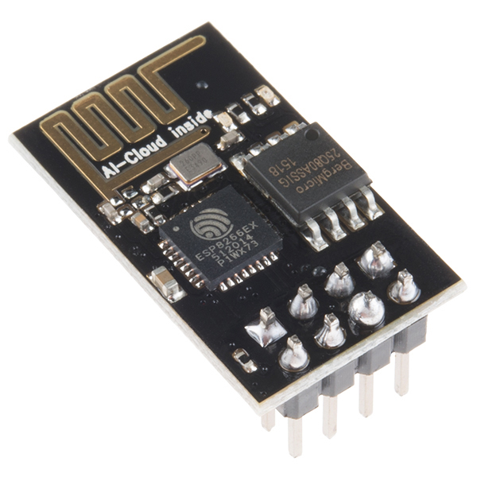
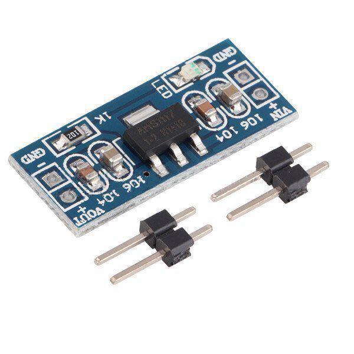
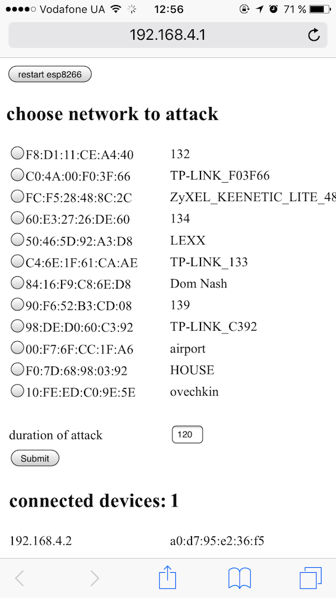

# esp8266_deauthenticator

This is an experiment about disconnecting clients from a wireless access point (AP) with a botnet based on esp8266 (NodeMCU for hub and esp-01 for bots).

## Equipment

1. NodeMCU ESP-12E  

1. ESP8266 ESP-01  

1. AMS1117 3.3v  

## Setting up the environment

It is impossible to send manage frames (with `wifi_send_pkt_freedom()`) of any type except for beacon frames in Espressif SDK v1.4 , even though it was possible in Espressif SDK v1.3. To be able to do it, you need to configure Arduino IDE appropriately. The instruction can be found [here](https://github.com/markszabo/Hacktivity2016#setting-up-the-environment-1).

## Working Principle

1. Scanning for APs in the coverage area of the hub and choosing the AP for deauthenticating.

   The hub creates an AP for bots and the user, who have to connect to it, open 192.168.4.1 in his browser and choose the AP to attack.  
   

1. Identifying devices connected to the AP.

   The hub disables its own AP and enables a monitor mode in order to find the AP`s clients. Then it turns the AP on again and waits until the bots connect to it.

1. Transfering information about the AP and its clients to the bots.

   The hub creates a UPD packet with information about the AP and its clients and sends it to broadcast.

1. Deauthentication and beacon frames form at this point.

   Bots form beacon frames with fake information about the AP to prevent the client from retrying  to connect and deauthentication frames pretending to be the AP.

1. Repetitive sending of these frames

## Connection Map

| ESP-01 | AMS1117 |
| ------ | ------- |
| GND    | GND     |
| CH_PD  | Vout    |
| Vcc    | Vout    |

## References

* [Hacktivity2016](https://github.com/markszabo/Hacktivity2016)
* [WiFiBeaconJam](https://github.com/kripthor/WiFiBeaconJam)
* [esp8266-deauth](https://github.com/RandDruid/esp8266-deauth)
* [esp8266-injection-example](https://github.com/pulkin/esp8266-injection-example)
